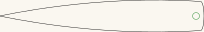
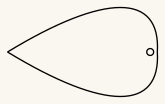
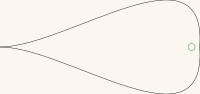
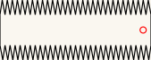

# Bullroarer — five blade profiles

A bullroarer is a flat blade on a cord. Whirled overhead, it spins about its own
long axis while it circles, and the alternating faces chop the air into a pulsing
roar. The pitch follows how fast you swing it; the shape of the blade decides how
readily it spins and how much of the sound is roar rather than whistle.

Five profiles, all cut-ready. They differ only in outline — every one is a single
closed cut with one 7mm cord hole.

## Get the files

- **[Everything as a ZIP](https://github.com/Gernreich/bullroarer/archive/refs/heads/main.zip)**
  — all five profiles.
- **[Repository](https://github.com/Gernreich/bullroarer)** — if you want to change
  a profile or read the geometry.
- Or click any picture below to download that one cut file.

Released under CC0 1.0 — do what you like with them, no attribution needed. Built for
**[LaserMadeMusic](https://www.youtube.com/@LaserMadeMusic)**.

## The five profiles

Click any of these to download the cut file. The pictures are display renderings —
the cut files draw a hairline on no background at all, which a browser shows almost
invisibly, so these are thickened and painted onto a light ground and cropped to the
part. **Each is shown at its own scale**, so the sizes below are the ones that matter,
not how large the picture looks.

<table>
<tr>
<td align="center"></td>
<td align="center"></td>
<td align="center"></td>
</tr>
<tr>
<td align="center">Rectangular · 200 × 42mm</td>
<td align="center">Convex narrow tapered · 204 × 33mm</td>
<td align="center">Convex tapered · 151 × 89mm</td>
</tr>
<tr>
<td align="center"></td>
<td align="center"></td>
<td></td>
</tr>
<tr>
<td align="center">Concave tapered · 200 × 95mm</td>
<td align="center">Sawtooth · 169 × 68mm</td>
<td></td>
</tr>
</table>

## What the files contain

Measured out of the files themselves, not copied from whatever drew them:

| Profile | Blade | Cord hole | Hole centre |
|---|---|---|---|
| `BullroarerRectangular.svg` | 200.0 × 42.1mm | 7mm | 11mm from the near end |
| `BullroarerConvexNarrowTapered.svg` | 204.3 × 32.9mm | 7mm | 8mm from the blunt end |
| `BullroarerConvexTapered.svg` | 150.5 × 89.3mm | 7mm | 8mm from the round end |
| `BullroarerConcaveTapered.svg` | 200.3 × 94.6mm | 7mm | 8mm from the round end |
| `BullroarerSawtooth.svg` | 169.2 × 67.6mm | 7mm | 9mm from the near end |

**Every cord hole sits on the blade's long centreline.** That is not decoration: a hole
off the centreline makes the blade spin unevenly and the roar stutters.

Each file is one sheet, 495 × 279mm, with the blade positioned on it. Output is
millimetre-true — `1 user unit = 1 mm` with a physical `width`/`height` — so it prints
and cuts at real size. Every line is a cut; there is no engrave layer and nothing to
map by colour.

## Before you cut

**Cut these in 3mm Baltic birch plywood** — that is what they are built in. It matters
more than the profile does: a bullroarer has to survive being whirled hard on a cord, and
the blade is the part that fails. Ply can delaminate and a knot can split out through the
cord hole, so run the face grain along the blade rather than across it. Baltic birch earns
its place here for its void-free core; a cheaper ply with voids is a weak blade waiting to
find them.

**The cord is not in these files.** Neither is any advice on it, because the right cord
is a function of your blade's mass and how hard you intend to swing. A swivel between
cord and blade is worth considering: without one the cord twists up as the blade spins.

**This is not a toy and it needs space.** A bullroarer on a long cord sweeps a circle
several metres across at head height, and it is loud on purpose.

## Files

| | |
|---|---|
| `Bullroarer*.svg` | the five cut-ready profiles |
| `previews/` | display renderings — **not** cut files |
| `index.md` · `index.html` | this page; the markdown is the source |
